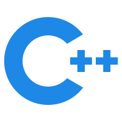

<p align="center">
    
</p>

#  A simple calculator to learn C++ basic project files required

#### Base Program

This is a simple C++ project for learning the file structure and deployment of the project:hugs:

#### Update

+ **2023.12.17**:Linux+Windows platform makefile.:mag:

+ **2023.12.16**:Base code in cpp:cactus:

#### Todo

- [x] Add Gradio webui.
- [ ] Add more cal method.eg:sin,cos,log.

#### Dependencies and Installation

+ opsys:Linux 6.2.0-39-generic #40~22.04.1-Ubuntu
+ gcc version :11.4.0 (Ubuntu 11.4.0-1ubuntu1~22.04) 
+ python==3.10.8
+ Gradio==3.44.4

Linux

```latex
# clone this repo
git clone https://github.com/Justin-12138/Calculator.git

# build
make
```

Windows

```latex
# clone this repo
git clone https://github.com/Justin-12138/Calculator.git

# create python virtual environment
python -m venv .
pip install gradio==3.44.4
make

```

Docker

```latex

```

#### License

This project is licensed under <a rel="license" href="https://github.com/Justin-12138/Calculator/blob/main/LICENSE">MIT License</a>. Redistribution and use should follow this license.

#### Contact

If you have any questions, please feel free to reach me out at `justinliu707@gmail.com`. 
